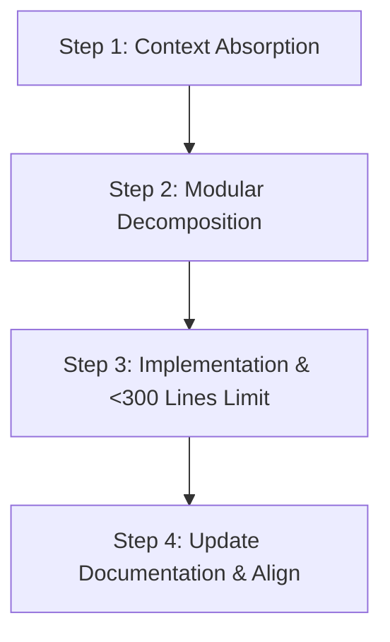
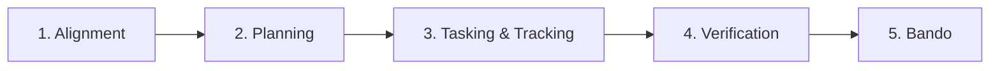

# Core AI Developer Standard (v1.0)
This standard defines the universal rules, workflows, and templates required to optimize AI developer performance on **any** software project (Web, Mobile, Desktop, CLI, Backend, or Game).

**Any AI agent interacting with this codebase MUST read and strictly adhere to this document.**

---

## 1. Project Navigation: `overview.md` Template
Every project utilizing this standard MUST have a central `overview.md` file at the root or within the main documentation folder. It acts as the primary index for the AI to understand the workspace.

When creating or modifying an `overview.md` file, use the following generic template:

```markdown
# Project Name: [Project Title]

## 1. Executive Summary
Brief, high-level description of what the project does, the target users, and the core problem it solves.

## 2. Core Tech Stack
- **Languages**: [e.g., C#, C++, JavaScript/TypeScript, Python, Rust]
- **Engine/Frameworks**: [e.g., Unity, Unreal, React, Express, FastAPI]
- **Storage/Databases**: [e.g., PostgreSQL, SQLite, PlayerPrefs, Redis]
- **Deployment/Build System**: [e.g., Vercel, Docker, Gradle, Unity Cloud Build]

## 3. High-Level System Architecture
[Embed a Mermaid diagram representing the primary architectural layout of the application here]

## 4. Codebase Directory Map
A descriptive mapping of the folders in this repository:
- `[folder/path]`: [Clear explanation of what files reside here and their role]
- `[folder/path]`: [Clear explanation]

## 5. Core Module Registry (Feature Map)
| Feature / Module Name | Code Entry Path | Specification Link | Status |
|-----------------------|-----------------|--------------------|--------|
| [ModuleName]          | [path/to/code]  | [Link to Spec Doc] | [Production/Alpha/Beta] |

## 6. Reference Links
- [Coding Standard/Rules](file:///path/to/rules.md) - Coding standards.
- [API or Protocol Specs](file:///path/to/protocol_or_api.md) - API/protocol reference.
- [Data Model/Database Schema](file:///path/to/schema.md) - Data structures reference.
```

---

## 2. Universal 4-Step AI Workflow
When tasked with implementing a new feature, debugging, or refactoring, the AI MUST execute the following sequence:



### Step 1: Context Absorption
*   Locate and read the project's `overview.md`.
*   Read the specifications of the module being touched (found in specifications folder or the module registry).
*   Parse the Mermaid diagrams detailing the data flow of the target modules.

### Step 2: Modular Decomposition (Plan First)
*   Draft an implementation plan.
*   Scan the target files that will be modified.
*   **Crucial Rule**: Ensure that no file will exceed **300 lines of code** post-implementation. If a file is projected to grow beyond 300 lines, you MUST plan to decompose it (e.g., extract utility functions, create sub-components, helper classes, or service layers).

### Step 3: Implementation
*   Write clean, declarative, and self-documenting code.
*   Use Type Annotations, JSDoc, C# XML docs, or Python type hints to guarantee precise parameter contracts.
*   Never write monolithic functions. Keep each function focused on a single responsibility.

### Step 4: Update Documentation & Align
*   If your changes update the system structure, data flow, or class structures, immediately update the relevant Mermaid diagrams and module documentation.
*   Never leave documentation outdated.

---

## 3. Feature Discovery & Maintenance Protocol (Dormant Features)
When working on dormant features (code that hasn't been touched in a long time) or when onboarding onto a large module, the AI **MUST NOT** guess file paths or crawl the directory structure blindly. The AI must execute this strict discovery process:

```
[Start Task]
     │
     ▼
Read "overview.md" ──▸ Search "Core Module Registry" ──▸ Locate Feature Specification
                                                                  │
                                                                  ▼
Update Registry/Mermaid ◄── Implement Code ◄── Read Spec & Mermaid Flowchart
```

1.  **Registry Lookup**: Search the **Core Module Registry** inside `overview.md` to identify the correct entry points and the official specification file for that feature.
2.  **Absorption of Specific Context**: Open and read the feature specification file (e.g., [docs/features/auth.md](file:///e:/_Web/VuFamily/docs/features/AUTH.md)). Study its business rules, edge cases, and its specific Mermaid flowcharts representing its control and data flow.
3.  **Code Inspection**: Only after digesting the specification can the AI inspect the registered entry points in the codebase.
4.  **Registration Enforcement**: If a feature is found to be missing from the registry in `overview.md`, the AI **MUST** add it, create its specific specification file, and write a flow diagram before modifying the code.
5.  **Documentation Synchronization**: Upon completing modifications to a dormant feature, the AI **MUST** update its specification file and Mermaid diagrams to reflect any structural or protocol changes.

---

## 4. Feature Development Lifecycle & Progress Tracking
Every feature implementation or complex modification **MUST** follow a structured lifecycle. The AI must document and update the progress transparently so the developer can track status at any moment.



### Phase 1: Alignment (Context Absorption)
*   **Action**: Read `overview.md` to understand the system context. Open the target feature spec doc (e.g., `docs/features/feature_name.md`) and analyze the data flow Mermaid diagrams.
*   **Result**: Ensure full understanding of business rules, constraints, and architecture.

### Phase 2: Planning (Implementation Plan)
*   **Action**: Create or update the `implementation_plan.md` artifact.
    *   List the proposed changes (grouping modified, deleted, and [NEW] files).
    *   Detail architecture updates.
    *   Incorporate the **< 300 lines limit** strategy for each file.
    *   Specify the **Verification Plan** (how you will test).
*   **Approval Gate**: Stop and request user review. **DO NOT write source code until the user approves the implementation plan.**

### Phase 3: Tasking & Progress Tracking (`task.md`)
*   **Action**: Create a `task.md` file in the workspace or session context.
*   **Task List Format**: Break down the implementation into atomic checklist items (e.g., specific files, database migration, configs).
    *   Use `[ ]` for uncompleted tasks.
    *   Use `[/]` for active in-progress tasks.
    *   Use `[x]` for completed tasks.
*   **State Maintenance**: The AI **MUST** update the `task.md` checklist at the beginning and end of every subsequent turn to reflect real-time progress.

### Phase 4: Verification & Testing
*   **Action**: Implement automated tests (unit, integration, build scripts) as defined in the verification plan.
*   **Manual Checks**: Verify Edge cases, security parameters, and layouts (e.g., responsiveness or UI scaling).
*   **Status Logging**: Update `task.md` to reflect testing completions and log any test reports or outputs.

### Phase 5: Walkthrough & Delivery
*   **Action**: Create or update the `walkthrough.md` file summarizing:
    *   Changes made (with links to modified files).
    *   Test results & verification logs.
    *   Mermaid diagram updates reflecting the final implementation.
    *   Visual proof (screenshots, layout mockup logs) if there are UI/UX changes.
*   **Delivery**: Direct the user to review the walkthrough file for final validation.

---

## 5. Code Length & Decomposition Rules
To maximize AI parsing speed and accuracy, code complexity must be strictly managed:
*   **Hard Limit**: Individual source code files should ideally remain **under 300 lines**.
*   **Actions to take when approaching the 300-line limit**:
    1.  **Extract Helpers**: Identify pure functions (calculations, math operations, date conversions, formatting) and move them to utility files (e.g., `utils/`, `helpers/`).
    2.  **Separate UI from Logic**: Keep UI components/scenes purely about rendering and delegate state, logic, and network handling to controllers, custom hooks, or managers.
    3.  **Split Large Submodules**: Break down complex classes or scripts into smaller, highly-focused classes or scripts.
    4.  **Composition over Inheritance**: Use modular helper classes, components, or middleware rather than expanding base class sizes.

---

## 6. Mermaid Diagram Standards for AI
Diagrams are the fastest way for LLMs to understand code execution. When creating Mermaid diagrams, follow these rules:

*   **Keep it clean**: Avoid deeply nested loops or error-handling flows in high-level diagrams.
*   **Format labels**: Quote labels containing special characters (e.g., parentheses or brackets) to avoid parser errors (e.g., `id["Label (Extra)"]`).
*   **Use the correct diagram type**:
    *   Use **Flowcharts (`graph TD` / `flowchart LR`)** for business logic, conditional branching, and API/event cycles.
    *   Use **Sequence Diagrams (`sequenceDiagram`)** for client-server authentication, database transactions, network handshake, or multi-service request flows.
    *   Use **State Diagrams (`stateDiagram-v2`)** for state machines (e.g., player states, order processing, request approval workflows).

---

## 7. Universal Code Quality & Programming Rules
Any AI contributing to this codebase **MUST** satisfy these programming standards across all languages:

### 7.1. Naming Conventions (Self-Documenting Code)
*   **Variables & Functions**: ALWAYS use `camelCase` (e.g., `userSessionToken`, `calculateTotalCost`). Avoid ambiguous abbreviations (e.g., use `index` instead of `i` in outer scopes, `networkResponse` instead of `res`).
*   **Classes, Types, & Components**: ALWAYS use `PascalCase` (e.g., `UserManager`, `TreeCanvas`, `ConfigAPI`).
*   **Constants**: ALWAYS use `SCREAMING_SNAKE_CASE` (e.g., `MAX_RETRY_LIMIT`, `DEFAULT_THEME_COLOR`).
*   **Booleans**: Prefix boolean variables/functions with active verbs (e.g., `isEnabled`, `hasToken`, `shouldRender`).

### 7.2. Error Handling (Fail-Safe Execution)
*   **No Silent Failures**: NEVER silently swallow exceptions. Empty `catch` blocks are strictly forbidden. Always log the error or propagate it in a managed way.
*   **Descriptive Errors**: Throw rich error objects/exceptions containing context (e.g., `throw new Error("Failed to parse user profile: missing ID field")`).
*   **Boundary Protection**: Always wrap asynchronous calls, file I/O operations, network requests, and JSON parsing in `try-catch` structures.

### 7.3. Logging Standards
*   **Log Classification**: Categorize logs by severity:
    *   `Debug`: For verbose details during development (must be compiled out or disabled in production).
    *   `Info`: For key operations (e.g., "User logged in successfully", "Database connected").
    *   `Warning`: For non-blocking issues (e.g., "API fallback config used").
    *   `Error`: For critical failures (e.g., "Payment gateway failed").
*   **Unified Logger**: Use the project's custom logger if one exists. Do not scatter raw standard prints (e.g., `console.log`, C# `Debug.Log`, Python `print`) in production code.

### 7.4. Security Protocols
*   **Zero Credentials in Source**: NEVER commit API keys, database credentials, JWT secrets, passwords, or tokens to the repository. Use environment variable files (e.g., `.env`, config providers) instead.
*   **Input Validation & Sanitization**: Always validate external inputs (arguments, payload parameters, query strings) before processing them in database queries, scripts, or rendering templates to prevent injection attacks (SQL/NoSQL/XSS).

### 7.5. Simplicity and Maintainability (DRY & KISS)
*   **Don't Repeat Yourself (DRY)**: Abstract repeated sequences of 3 lines or more into reusable utility functions, hooks, or classes.
*   **Keep It Simple (KISS)**: Prioritize clean, readable, declarative code over "clever" or overly concise code (e.g., avoid deep nested ternary operators or highly complex regex patterns if simple string operations suffice).
*   **Why, Not What**: Write comments to explain *why* a specific approach or workaround was taken, rather than explaining *what* the code does. The code itself should be readable enough to explain the *what*.

---

## 8. Universal AI-Optimization Guidelines
Implementing these structural elements will make any AI tool working on the codebase 2x faster and 3x more accurate:

1.  **Type Annotations**:
    *   Always use static typing (TypeScript, C#, C++) or explicit type hints (Python, JSDoc in JS).
    *   *Why*: Prevents the AI from guessing type schemas, eliminating common type and reference errors.
2.  **Explicit AI Context Files (`.ai_context.md`)**:
    *   Keep a simple `.ai_context.md` file at the root. Update it with:
        *   The active goal.
        *   Recent changes.
        *   Known bugs or gotchas.
        *   Pending tasks.
    *   *Why*: Solves context decay and token limitations across different chat sessions.
3.  **Strict Facade Layering**:
    *   Abstract all external third-party calls (APIs, Firebase, engine plugins, OS features) behind local wrappers or facade APIs.
    *   *Why*: The AI only needs to parse the signature of your local wrapper, avoiding reading huge external library types.
4.  **Consistent Folder Schemas**:
    *   Organize code into feature-based folders. Ensure every feature contains exactly the same set of subfolders (e.g., `components/`, `utils/`, `tests/` or `Scripts/`, `Prefabs/`, `Tests/`).
    *   *Why*: A consistent pattern allows the AI to rely on structural analogies to write files correctly.
