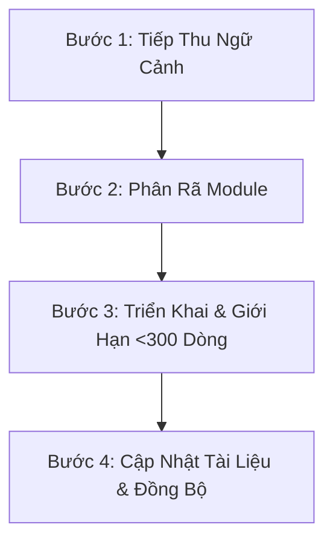
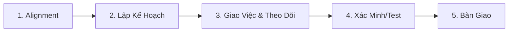

# Tiêu Chuẩn Phát Triển AI Cốt Lõi (v1.0)
Tài liệu này định nghĩa các quy tắc, quy trình (workflows) và các mẫu tài liệu (templates) chung bắt buộc để tối ưu hóa hiệu suất làm việc của AI trên **mọi** dự án phần mềm (Web, Mobile App, Desktop, CLI, Backend, hoặc Game).

**Mọi Agent AI khi làm việc với codebase này PHẢI đọc và tuân thủ nghiêm ngặt tài liệu này.**

---

## 1. Bản Đồ Điều Hướng Dự Án: Mẫu File `overview.md`
Mọi dự án áp dụng tiêu chuẩn này PHẢI có một file `overview.md` đặt ở thư mục gốc hoặc thư mục tài liệu chính. File này là bản đồ chỉ đường đầu tiên để AI hiểu nhanh toàn bộ workspace.

Khi tạo mới hoặc cập nhật file `overview.md`, hãy sử dụng mẫu chung sau:

```markdown
# Tên Dự Án: [Tên dự án]

## 1. Tóm Tắt Dự Án (Executive Summary)
Mô tả ngắn gọn, súc tích về vai trò của dự án, người dùng mục tiêu và vấn đề cốt lõi mà dự án giải quyết.

## 2. Công Nghệ Cốt Lõi (Core Tech Stack)
- **Ngôn ngữ lập trình**: [Ví dụ: C#, C++, JavaScript/TypeScript, Python, Rust]
- **Engine/Frameworks**: [Ví dụ: Unity, Unreal, React, Express, FastAPI]
- **Cơ sở dữ liệu**: [Ví dụ: PostgreSQL, SQLite, PlayerPrefs, Redis]
- **Hệ thống Build/Triển khai**: [Ví dụ: Vercel, Docker, Gradle, Unity Cloud Build]

## 3. Kiến Trúc Hệ Thống Tổng Quan (System Architecture)
[Vẽ sơ đồ Mermaid biểu diễn luồng kiến trúc hệ thống tổng quan tại đây]

## 4. Bản Đồ Thư Mục Codebase (Codebase Directory Map)
Mô tả chức năng của từng thư mục trong repo:
- `[đường/dẫn/thư/mục]`: [Giải thích rõ ràng các file nằm ở đây đóng vai trò gì]
- `[đường/dẫn/thư/mục]`: [Giải thích rõ ràng]

## 5. Danh Mục Các Module Chính (Bản đồ Tính năng)
| Tên Tính năng / Module | Đường Dẫn Code Chính | Đường Dẫn Tài Liệu Spec | Trạng Thái |
|-----------------------|-----------------------|--------------------------|------------|
| [Tên Module]          | [path/to/code]        | [Link đến Spec Doc]      | [Production/Alpha/Beta] |

## 6. Liên Kết Tài Liệu Tham Chiếu
- [Quy tắc lập trình](file:///path/to/rules.md) - Tiêu chuẩn viết code.
- [Đặc tả API hoặc Giao thức](file:///path/to/protocol_or_api.md) - Tài liệu API/giao thức kết nối.
- [Thiết kế Database / Model](file:///path/to/schema.md) - Schema dữ liệu hoặc cấu trúc model.
```

---

## 2. Quy Trình 4 Bước Chuẩn Của AI (Universal Workflow)
Khi thực hiện một tính năng mới, sửa lỗi hoặc tái cấu trúc code, AI BẮT BUỘC phải tuân theo luồng xử lý sau:



### Bước 1: Tiếp Thu Ngữ Cảnh (Context Absorption)
*   Tìm và đọc kỹ file `overview.md` của dự án.
*   Đọc tài liệu mô tả chi tiết của tính năng hoặc module cần chỉnh sửa (nằm trong thư mục tài liệu hoặc registry).
*   Xem các sơ đồ luồng dữ liệu Mermaid của module đó để hiểu luồng đi của dữ liệu.

### Bước 2: Phân Rã Module (Plan First)
*   Viết bản kế hoạch triển khai (Implementation Plan) nháp.
*   Quét qua các file sẽ bị chỉnh sửa.
*   **Quy tắc tối quan trọng**: Đảm bảo sau khi code xong, không có file nào vượt quá **300 dòng code**. Nếu file có xu hướng phình to trên 300 dòng, bạn BẮT BUỘC phải lập kế hoạch chia nhỏ nó ra (ví dụ: tách hàm utils, tách components con, tạo helper classes, hoặc controllers).

### Bước 3: Triển Khai Viết Code (Implementation)
*   Viết code rõ ràng, mang tính khai báo (declarative) và tự giải thích (self-documenting).
*   Viết đầy đủ Type Annotations, JSDoc, C# XML docs, hoặc Python type hints để đảm bảo AI khác hoặc con người gọi hàm biết rõ kiểu tham số truyền vào và kiểu trả về.
*   Không viết các hàm quá dài thực hiện nhiều việc. Mỗi hàm chỉ nên tập trung làm tốt 1 việc duy nhất (Single Responsibility).

### Bước 4: Cập Nhật Tài Liệu & Đồng Bộ (Update Documentation & Align)
*   Nếu code của bạn làm thay đổi cấu trúc hệ thống, luồng dữ liệu hoặc cấu trúc class, hãy cập nhật ngay sơ đồ Mermaid và tài liệu spec tương ứng.
*   Không bao giờ để tài liệu bị lỗi thời so với code thực tế.

---

## 3. Quy Trình Truy Xuất & Bảo Trì Tính Năng Cũ (Dormant Features)
Khi phải làm việc với các tính năng cũ (đã lâu không chạm vào) hoặc khi mới bắt đầu nghiên cứu một module lớn, AI **KHÔNG ĐƯỢC PHÉP** tự đoán đường dẫn file hay quét thư mục một cách mò mẫm. AI bắt buộc phải thực hiện quy trình truy vết nghiêm ngặt sau:

```
[Bắt đầu Tác vụ]
        │
        ▼
Đọc "overview.md" ──▸ Quét danh mục "Module Registry" ──▸ Mở tài liệu Spec của Tính năng
                                                                     │
                                                                     ▼
Cập nhật Registry/Mermaid ◄── Viết Code Thực Tế ◄── Đọc Spec & Sơ đồ Luồng Mermaid
```

1.  **Tra cứu Danh mục**: Truy cập **Danh Mục Các Module Chính** trong file `overview.md` để xác định chính xác đường dẫn code chính và file tài liệu đặc tả (specification) của tính năng đó.
2.  **Tiếp thu Ngữ cảnh Chi tiết**: Mở và đọc file đặc tả tính năng tương ứng (ví dụ: [docs/features/auth.md](file:///e:/_Web/VuFamily/docs/features/AUTH.md)). Nghiên cứu kỹ các quy tắc nghiệp vụ, các edge cases và sơ đồ luồng Mermaid của riêng tính năng đó.
3.  **Khảo sát Code**: Chỉ sau khi đã hiểu rõ file đặc tả, AI mới được phép mở và đọc các file code tại các đường dẫn đã đăng ký trong danh mục.
4.  **Bổ sung Danh mục**: Nếu phát hiện một tính năng cũ đang tồn tại trong code nhưng chưa có tên trong danh mục `overview.md`, AI **BẮT BUỘC** phải đăng ký bổ sung, tạo file đặc tả chi tiết và vẽ sơ đồ luồng trước khi tiến hành sửa code.
5.  **Đồng bộ hóa Tài liệu**: Sau khi hoàn thành việc chỉnh sửa tính năng, AI **BẮT BUỘC** phải cập nhật lại file đặc tả và sơ đồ Mermaid của tính năng đó để phản ánh chính xác trạng thái hoạt động hiện tại.

---

## 4. Chu Kỳ Phát Triển Tính Năng & Theo Dõi Tiến Độ
Mọi việc xây dựng tính năng mới hoặc chỉnh sửa cấu trúc phức tạp **BẮT BUỘC** phải tuân theo chu kỳ phát triển chuẩn hóa dưới đây. AI phải cập nhật tiến độ công việc một cách minh bạch để lập trình viên có thể kiểm tra bất kỳ lúc nào.



### Giai đoạn 1: Alignment (Tiếp Thu Ngữ Cảnh)
*   **Hành động**: Đọc `overview.md` của dự án để nắm kiến trúc chung, sau đó mở file tài liệu đặc tả của tính năng đích (ví dụ: `docs/features/feature_name.md`) để phân tích yêu cầu nghiệp vụ và sơ đồ luồng Mermaid của nó.
*   **Kết quả**: Đảm bảo hiểu rõ các ràng buộc, edge cases và các mối liên hệ hệ thống trước khi làm.

### Giai đoạn 2: Lập Kế Hoạch (Implementation Plan)
*   **Hành động**: Khởi tạo hoặc cập nhật file kế hoạch triển khai `implementation_plan.md` dưới dạng artifact.
    *   Liệt kê danh sách các file sẽ bị sửa đổi, xóa hoặc tạo mới [NEW].
    *   Mô tả chi tiết sự thay đổi cấu trúc hệ thống.
    *   Đề xuất phương án chia nhỏ logic để đảm bảo quy tắc **giới hạn file dưới 300 dòng**.
    *   Xác định kế hoạch kiểm thử (Verification Plan) chi tiết.
*   **Duyệt Kế Hoạch**: **KHÔNG ĐƯỢC PHÉP viết code nguồn trước khi người dùng phê duyệt file `implementation_plan.md`.**

### Giai đoạn 3: Phân Task & Cập Nhật Tiến Độ (`task.md`)
*   **Hành động**: Khởi tạo file theo dõi tác vụ `task.md` tại thư mục làm việc.
*   **Định dạng Danh sách Task**: Chia nhỏ kế hoạch triển khai thành các đầu việc nhỏ (ví dụ: tạo file C, chỉnh sửa file D, chạy script database).
    *   Sử dụng `[ ]` cho các task chưa thực hiện.
    *   Sử dụng `[/]` cho các task đang được thực thi.
    *   Sử dụng `[x]` cho các task đã hoàn thành.
*   **Cập nhật Tiến độ**: AI **BẮT BUỘC** phải cập nhật lại trạng thái của danh sách task trong `task.md` ở đầu và cuối mỗi lượt tương tác (mỗi câu trả lời) để người dùng nắm được tiến trình thực tế.

### Giai đoạn 4: Xác Minh & Kiểm Thử
*   **Hành động**: Chạy các bộ test tự động (unit tests, integration tests, build scripts) như đã đề ra ở Giai đoạn 2.
*   **Kiểm tra thủ công**: Xác minh hiển thị (Responsive giao diện trên các thiết bị, tỷ lệ co giãn) và kiểm thử các edge cases logic.
*   **Ghi nhận kết quả**: Cập nhật kết quả test thành công hoặc logs lỗi vào file `task.md`.

### Giai đoạn 5: Tổng Kết Bàn Giao (Walkthrough)
*   **Hành động**: Khởi tạo hoặc cập nhật file bàn giao `walkthrough.md` tổng hợp:
    *   Các thay đổi thực tế đã thực hiện (kèm link click được đến các file mã nguồn).
    *   Kết quả kiểm thử & logs xác minh thành công.
    *   Sơ đồ Mermaid đã cập nhật (nếu code làm thay đổi luồng hệ thống).
    *   Bằng chứng trực quan (hình ảnh giao diện thực tế) nếu có sự thay đổi về UI/UX.
*   **Bàn giao**: Thông báo và hướng dẫn người dùng mở file walkthrough để tiến hành nghiệm thu cuối cùng.

---

## 5. Quy Tắc Giới Hạn Dòng Code & Chia Nhỏ File (Decomposition Rules)
Để tối ưu tốc độ đọc và độ chính xác của AI, độ phức tạp của code cần được quản lý chặt chẽ:
*   **Giới hạn cứng**: Mỗi file source code nên được giữ **dưới 300 dòng**.
*   **Cách xử lý khi file gần chạm hoặc vượt quá 300 dòng**:
    1.  **Tách các hàm Helper**: Đưa các hàm xử lý tính toán thuần túy (format ngày tháng, tính toán toán học, parse chuỗi) ra các file util riêng biệt (ví dụ: `utils/`, `helpers/`).
    2.  **Tách Biệt UI & Logic**: Giữ UI components/scenes thuần túy cho hiển thị và bàn giao quản lý state, logic, mạng cho controllers, custom hooks, hoặc managers.
    3.  **Chia nhỏ UI Component/Submodule**: Tách các phần giao diện hoặc các class phức tạp thành các component/class con nhỏ hơn.
    4.  **Ưu tiên Composition (Ủy thác)**: Sử dụng các class helper hoặc middleware thay vì kế thừa class quá sâu làm phình to file.

---

## 6. Tiêu Chuẩn Vẽ Sơ Đồ Mermaid Cho AI
Sơ đồ là cách nhanh nhất để LLM (AI) hiểu luồng chạy của chương trình. Khi vẽ sơ đồ Mermaid, hãy nhớ:

*   **Đơn giản, rõ ràng**: Bỏ qua các chi tiết xử lý lỗi vụn vặt hoặc vòng lặp quá sâu trong các sơ đồ tổng quan.
*   **Định dạng nhãn (labels)**: Bọc nhãn chứa ký tự đặc biệt (như dấu ngoặc đơn/ngoặc vuông) trong dấu nháy kép để tránh lỗi cú pháp vẽ hình (ví dụ: `id["Nhãn (Bổ sung)"]`).
*   **Chọn đúng loại biểu đồ**:
    *   **Flowchart (`graph TD` / `flowchart LR`)**: Dành cho logic nghiệp vụ, rẽ nhánh điều kiện, và vòng đời API/sự kiện.
    *   **Sequence Diagram (`sequenceDiagram`)**: Dành cho luồng xác thực Client-Server, giao dịch Database, handshake mạng hoặc luồng gọi API đa dịch vụ.
    *   **State Diagram (`stateDiagram-v2`)**: Dành cho máy trạng thái (ví dụ: trạng thái nhân vật game, trạng thái đơn hàng, trạng thái duyệt yêu cầu).

---

## 7. Bộ Quy Tắc Chất Lượng Code & Lập Trình Chung
Mọi AI tham gia phát triển codebase này **PHẢI** tuân thủ các chuẩn mực lập trình sau trên mọi ngôn ngữ:

### 7.1. Quy Chuẩn Đặt Tên (Naming Conventions)
*   **Biến & Hàm**: LUÔN LUÔN dùng `camelCase` (ví dụ: `userSessionToken`, `calculateTotalCost`). Tránh viết tắt mập mờ (ví dụ: dùng `index` thay cho `i` trong các scope lớn, dùng `networkResponse` thay cho `res`).
*   **Class, Kiểu dữ liệu, & Component**: LUÔN LUÔN dùng `PascalCase` (ví dụ: `UserManager`, `TreeCanvas`, `ConfigAPI`).
*   **Hằng số**: LUÔN LUÔN dùng `SCREAMING_SNAKE_CASE` (ví dụ: `MAX_RETRY_LIMIT`, `DEFAULT_THEME_COLOR`).
*   **Biến Boolean**: Tiền tố của biến/hàm boolean phải là động từ hành động (ví dụ: `isEnabled`, `hasToken`, `shouldRender`).

### 7.2. Xử Lý Lỗi An Toàn (Error Handling)
*   **Không nuốt lỗi**: KHÔNG bao giờ im lặng nuốt ngoại lệ (exception). Tuyệt đối cấm viết block `catch` rỗng. Luôn ghi log lỗi hoặc ném ngoại lệ có kiểm soát lên tầng trên.
*   **Ném lỗi chi tiết**: Ném các đối tượng lỗi/ngoại lệ có chứa ngữ cảnh chi tiết (ví dụ: `throw new Error("Failed to parse user profile: missing ID field")`).
*   **Bảo vệ biên**: Luôn bao bọc các tác vụ gọi bất đồng bộ, đọc/ghi file I/O, gọi mạng, và parse JSON bằng cấu trúc `try-catch`.

### 7.3. Tiêu Chuẩn Ghi Log (Logging)
*   **Phân loại Log**: Chia log theo mức độ nghiêm trọng:
    *   `Debug`: Chi tiết quá trình phát triển (phải tắt khi build production).
    *   `Info`: Các thao tác quan trọng thành công (ví dụ: "User logged in", "Database connected").
    *   `Warning`: Các vấn đề không gây tắc nghẽn (ví dụ: "API fallback config used").
    *   `Error`: Các lỗi nghiêm trọng (ví dụ: "Payment gateway failed").
*   **Sử dụng Logger chung**: Sử dụng logger tùy biến của dự án (nếu có). Tránh viết bừa bãi các câu lệnh in thô (ví dụ: `console.log`, C# `Debug.Log`, Python `print`) trong code chạy production.

### 7.4. Quy Tắc Bảo Mật (Security)
*   **Không lưu thông tin nhạy cảm trong Code**: KHÔNG bao giờ commit API keys, mật khẩu database, JWT secrets hoặc tokens lên git. Sử dụng biến môi trường (`.env`, config providers) thay thế.
*   **Kiểm tra dữ liệu đầu vào**: Luôn kiểm tra và làm sạch (validate & sanitize) dữ liệu đầu vào từ người dùng hoặc API bên ngoài trước khi truyền vào câu lệnh database, script, hoặc chèn vào UI hiển thị để ngăn chặn các lỗi injection (SQL/NoSQL/XSS).

### 7.5. Đơn Giản & Dễ Bảo Trì (DRY & KISS)
*   **Không lặp lại code (DRY)**: Trích xuất các logic lặp lại từ 3 dòng trở lên thành các hàm helper, custom hooks, hoặc class dùng chung.
*   **Đơn giản là tốt nhất (KISS)**: Ưu tiên code rõ ràng, mang tính khai báo (declarative) hơn là viết code "nguy hiểm", ngắn gọn một cách phức tạp (tránh lồng ghép quá nhiều toán tử 3 ngôi, tránh dùng các chuỗi regex siêu phức tạp nếu có thể xử lý chuỗi cơ bản).
*   **Giải thích lý do tại sao (Why), không giải thích cái gì (What)**: Chỉ viết comment để giải thích *tại sao* đoạn code này được viết như vậy (ví dụ: giải thích một lỗi trình duyệt cần bypass), không viết comment mô tả dòng code đang làm cái gì nếu code đã tự giải thích được.

---

## 8. Khuyến Nghị Chung Từ Chuyên Gia AI Để Đạt Hiệu Suất Tối Đa
Áp dụng các yếu tố cấu trúc dưới đây sẽ giúp các công cụ AI hỗ trợ bạn nhanh gấp 2 lần và chính xác gấp 3 lần:

1.  **Viết Type Annotations đầy đủ**:
    *   Luôn sử dụng kiểu dữ liệu tĩnh (TypeScript, C#, C++) hoặc chú thích kiểu tường minh (Python Type Hints, JSDoc).
    *   *Lợi ích*: Giúp AI không phải tự đoán kiểu dữ liệu, giảm thiểu 90% lỗi gọi sai hàm/thuộc tính.
2.  **Duy trì file Ngữ Cảnh AI riêng biệt (`.ai_context.md`)**:
    *   Đặt một file `.ai_context.md` ở thư mục gốc của dự án. Cập nhật nó mỗi khi kết thúc phiên làm việc:
        *   Mục tiêu hiện tại.
        *   Các thay đổi cấu trúc quan trọng vừa làm.
        *   Bugs hoặc điểm lưu ý cần nhớ.
        *   Các bước cần làm tiếp theo.
    *   *Lợi ích*: Giúp AI đọc và tiếp tục công việc ngay lập tức mà không bị mất ngữ cảnh khi bắt đầu chat mới.
3.  **Tách biệt lớp Facade**:
    *   Tránh gọi trực tiếp các thư viện bên thứ 3 (API bên ngoài, SDK bên thứ ba, Driver) ở khắp nơi. Hãy bọc chúng lại trong các file Helper/Facade nội bộ.
    *   *Lợi ích*: AI chỉ cần đọc file Facade nhỏ gọn của bạn thay vì phải quét qua các định nghĩa kiểu dữ liệu đồ sộ của thư viện ngoài.
4.  **Thư mục đồng nhất (Consistent Folders)**:
    *   Tổ chức code theo module/tính năng rõ ràng. Các thư mục tính năng nên có cấu trúc giống hệt nhau.
    *   *Lợi ích*: Giúp AI dễ dàng suy luận cấu trúc file mới và tự động import chính xác nhờ thói quen của cấu trúc cũ.
