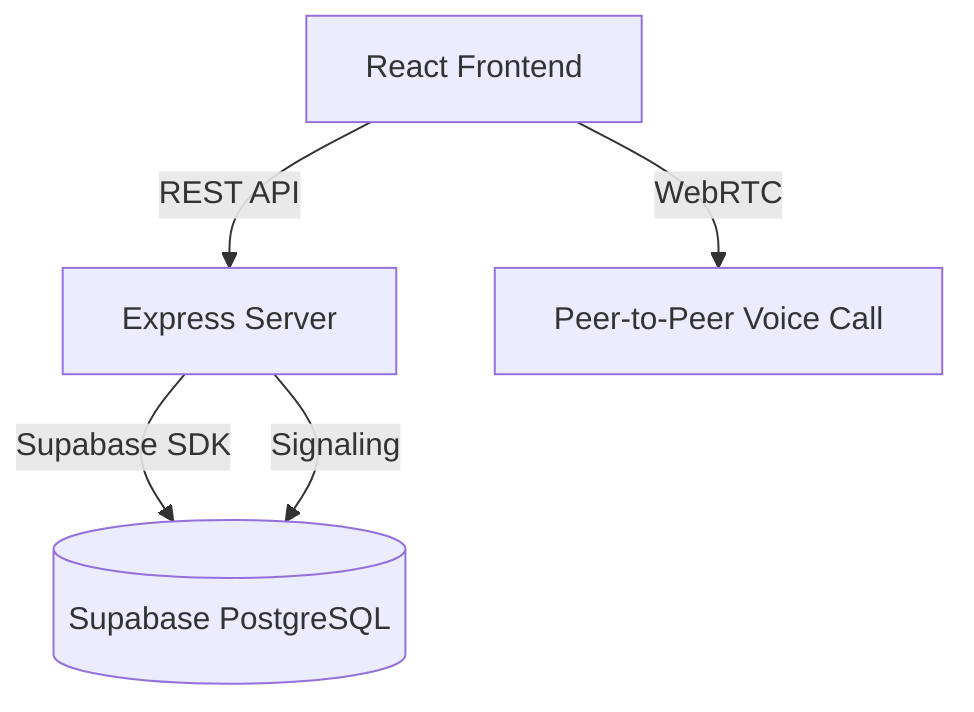

# VuFamily System Architecture

## Technologies Stack

### Frontend
- **Framework**: React.js (Vite)
- **Styling**: Vanilla CSS with custom Global Design System (variables, light/dark mode)
- **Deployment target**: PWA or Web, wrapped in Capacitor (Android/iOS) later.

### Backend
- **Framework**: Node.js & Express
- **Database**: Supabase (PostgreSQL)
- **Authentication**: JWT based, integrated with Supabase edge/tables.

---

## High-Level Architecture

*(Note: Voice call uses Supabase as a signaling server to exchange WebRTC SDP answers/offers).*

---

## Database Schema Overview

- `family_meta`: General title and origin of the tree.
- `members`: The core entity of the system. Has self-referencing foreign keys (`parent_id`, `spouse_id`) to build the tree.
- `users`: Authentication accounts. Links to `members` loosely if needed, but primarily used for admin/viewer roles and managing `update_requests`.
- `update_requests`: Viewers submit updates, admins approve to merge into `members`.
- `posts`, `comments`, `reactions`: Newsfeed system.
- `chat_rooms`, `chat_members`, `chat_messages`: Chat system.
- `calls`, `call_ice_candidates`: WebRTC signaling state.

## Core Layout Flow
The frontend heavily relies on `App.jsx` as the state container bridging the `Sidebar` and the central page components (`TreeCanvas`, `NewsfeedPage`, `ChatPage`, etc.).
