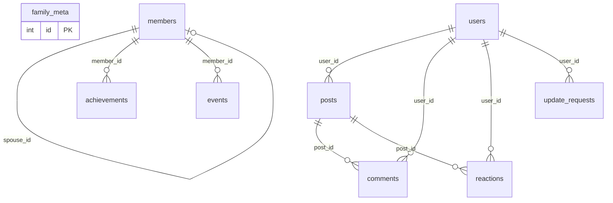

# 🗄️ Database Schema — VuFamily

> Supabase PostgreSQL  
> Project: `xalfitllpnjuzgmsreqw`  
> Chạy schema: `supabase-schema.sql` trong SQL Editor

---

## 📋 Danh Sách Bảng

| # | Bảng | Mô tả | RLS |
|---|------|--------|-----|
| 1 | `family_meta` | Thông tin dòng họ (tên, mô tả, quê quán) | ✅ |
| 2 | `members` | Thành viên gia phả | ✅ |
| 3 | `achievements` | Thành tựu / bằng cấp / công việc | ✅ |
| 4 | `events` | Sự kiện gia đình | ✅ |
| 5 | `users` | Tài khoản đăng nhập | ✅ |
| 6 | `update_requests` | Yêu cầu chỉnh sửa (viewer → admin) | ✅ |
| 7 | `posts` | Bảng tin dòng họ | ✅ |
| 8 | `comments` | Bình luận bài đăng | ✅ |
| 9 | `reactions` | Cảm xúc (emoji) bài đăng | ✅ |

---

## 📐 Chi Tiết Bảng

### 1. `family_meta` — Thông tin dòng họ

| Column | Type | Default | Mô tả |
|--------|------|---------|--------|
| `id` | `SERIAL` PK | auto | |
| `family_name` | `TEXT` | `'Vũ'` | Tên dòng họ |
| `description` | `TEXT` | `''` | Mô tả |
| `origin_place` | `TEXT` | `''` | Quê quán gốc |
| `created_at` | `BIGINT` | | Unix Timestamp (ms) |

---

### 2. `members` — Thành viên gia phả

| Column | Type | Constraints | Mô tả |
|--------|------|-------------|--------|
| `id` | `SERIAL` PK | | |
| `name` | `TEXT` | `NOT NULL` | Họ tên |
| `gender` | `SMALLINT` | `CHECK(0,1)` | 0=Nữ, 1=Nam |
| `birth_timestamp` | `BIGINT` | | Ngày sinh (Unix ms) |
| `death_timestamp` | `BIGINT` | | Ngày mất (Unix ms) |
| `birth_place` | `TEXT` | | Nơi sinh |
| `death_place` | `TEXT` | | Nơi mất |
| `occupation` | `TEXT` | | Nghề nghiệp |
| `phone` | `TEXT` | | SĐT |
| `email` | `TEXT` | | Email |
| `address` | `TEXT` | | Địa chỉ |
| `note` | `TEXT` | | Ghi chú |
| `photo` | `TEXT` | | Ảnh (base64 hoặc URL) |
| `birth_order` | `SMALLINT` | | Thứ tự con |
| `child_type` | `SMALLINT` | `CHECK(1,2)` | 1=Ruột, 2=Nuôi |
| `parent_id` | `INTEGER` FK | → `members(id)` ON DELETE SET NULL | Cha/mẹ |
| `spouse_id` | `INTEGER` FK | → `members(id)` ON DELETE SET NULL | Vợ/chồng |
| `generation` | `SMALLINT` | Default `1` | Đời thứ mấy |
| `created_at` | `BIGINT` | | Unix Timestamp (ms) |
| `updated_at` | `BIGINT` | | Unix Timestamp (ms) |

**Indexes:** `parent_id`, `spouse_id`, `name`, `generation`

**Quan hệ:**
```
members.parent_id → members.id   (self-referencing, cây gia phả)
members.spouse_id → members.id   (self-referencing, vợ/chồng)
```

---

### 3. `achievements` — Thành tựu

| Column | Type | Constraints | Mô tả |
|--------|------|-------------|--------|
| `id` | `SERIAL` PK | | |
| `member_id` | `INTEGER` FK | → `members(id)` CASCADE | |
| `category_id` | `SMALLINT` | | 1=Học tập, 2=Công việc, 3=Xã hội, 4=Giải thưởng, 5=Khác |
| `title` | `TEXT` | `NOT NULL` | Tiêu đề |
| `organization` | `TEXT` | | Tổ chức |
| `start_year` | `SMALLINT` | | Năm bắt đầu |
| `end_year` | `SMALLINT` | | Năm kết thúc |
| `description` | `TEXT` | | Mô tả |
| `created_at` | `BIGINT` | | Unix Timestamp (ms) |

---

### 4. `events` — Sự kiện

| Column | Type | Constraints | Mô tả |
|--------|------|-------------|--------|
| `id` | `SERIAL` PK | | |
| `member_id` | `INTEGER` FK | → `members(id)` SET NULL | |
| `event_type_id` | `SMALLINT` | Default `0` | 0=Khác, 1=Giỗ, 2=Họp mặt, 3=Cưới |
| `event_timestamp` | `BIGINT` | | Ngày diễn ra (Unix ms) |
| `title` | `TEXT` | `NOT NULL` | Tiêu đề |
| `description` | `TEXT` | | Mô tả |
| `created_at` | `BIGINT` | | Unix Timestamp (ms) |

---

### 5. `users` — Tài khoản

| Column | Type | Constraints | Mô tả |
|--------|------|-------------|--------|
| `id` | `SERIAL` PK | | |
| `username` | `TEXT` | `UNIQUE NOT NULL` | Tên đăng nhập |
| `password` | `TEXT` | `NOT NULL` | Hash bcrypt |
| `display_name` | `TEXT` | | Tên hiển thị |
| `role_id` | `SMALLINT` | `CHECK(1,2,3)` | 1=Admin, 2=Editor, 3=Viewer |
| `status_id` | `SMALLINT` | `CHECK(1,2)` | 1=Active, 2=Banned |
| `token` | `TEXT` | | Session token |
| `created_at` | `BIGINT` | | Unix Timestamp (ms) |
| `updated_at` | `BIGINT` | | Unix Timestamp (ms) |

**Default accounts (Tài khoản test):**
| Username | Role | Mặc định (Mật khẩu) |
|----------|------|----------------------|
| `dangvq` | admin | Quản trị chính (`DangVQ@2002`) |
| `admin1` -> `admin5` | admin | Tài khoản Admin Test (`Admin@1234`) |
| `test1` -> `test5` | viewer | Tài khoản Viewer Test (`Viewer@1234`) |

---

### 6. `update_requests` — Yêu cầu chỉnh sửa

| Column | Type | Constraints | Mô tả |
|--------|------|-------------|--------|
| `id` | `SERIAL` PK | | |
| `user_id` | `INTEGER` FK | → `users(id)` CASCADE | Người gửi |
| `member_id` | `INTEGER` | `NOT NULL` | Member cần sửa |
| `changes` | `TEXT` | `NOT NULL` | JSON thay đổi |
| `note` | `TEXT` | | Ghi chú |
| `status_id` | `SMALLINT` | Default `1` | 1=Pending, 2=Approved, 3=Rejected |
| `reviewed_by` | `INTEGER` FK | → `users(id)` SET NULL | Admin duyệt |
| `reviewed_at` | `BIGINT` | | Thời điểm duyệt (Unix ms) |
| `reject_reason` | `TEXT` | | Lý do từ chối |
| `created_at` | `BIGINT` | | Unix Timestamp (ms) |

---

### 7. `posts` — Bảng tin

| Column | Type | Constraints | Mô tả |
|--------|------|-------------|--------|
| `id` | `SERIAL` PK | | |
| `content` | `TEXT` | `NOT NULL` | Nội dung bài |
| `author_id` | `INTEGER` | `NOT NULL` | ID tác giả |
| `user_id` | `INTEGER` FK | → `users(id)` SET NULL | |
| `created_at` | `BIGINT` | | Unix Timestamp (ms) |

---

### 8. `comments` — Bình luận

| Column | Type | Constraints | Mô tả |
|--------|------|-------------|--------|
| `id` | `SERIAL` PK | | |
| `post_id` | `INTEGER` FK | → `posts(id)` CASCADE | Bài đăng |
| `content` | `TEXT` | `NOT NULL` | Nội dung |
| `author_id` | `INTEGER` | `NOT NULL` | ID tác giả |
| `user_id` | `INTEGER` FK | → `users(id)` SET NULL | |
| `created_at` | `BIGINT` | | Unix Timestamp (ms) |

---

### 9. `reactions` — Cảm xúc

| Column | Type | Constraints | Mô tả |
|--------|------|-------------|--------|
| `id` | `SERIAL` PK | | |
| `post_id` | `INTEGER` FK | → `posts(id)` CASCADE | Bài đăng |
| `user_id` | `INTEGER` FK | → `users(id)` CASCADE | Người react |
| `reaction_id` | `SMALLINT` | `NOT NULL` | 1=❤️, 2=👍, 3=😂, 4=😮, 5=😢 |
| `created_at` | `BIGINT` | | Unix Timestamp (ms) |

**Constraint:** `UNIQUE(post_id, user_id, reaction_id)` — mỗi user chỉ react 1 lần/emoji/bài

---

## 🔗 Sơ Đồ Quan Hệ



---

## 🔒 Row Level Security

Tất cả bảng đều bật RLS với policy:
```sql
CREATE POLICY "Service role full access" ON <table>
    FOR ALL USING (true) WITH CHECK (true);
```
> **Lưu ý:** Supabase service key tự động bypass RLS. 
> Policy này cho phép truy cập đầy đủ qua service role.
> Sử dụng `anon` key thì cần thêm policy phù hợp.

---

## 🔐 Tiêu Chuẩn Bảo Mật & Mã Hoá Dữ Liệu

Đảm bảo an toàn thông tin dòng họ là ưu tiên hàng đầu, do đó hệ thống được thiết kế theo các tiêu chuẩn bảo mật sau:

1. **Định danh qua ID:** Toàn bộ hệ thống quản lý danh tính (Tác giả bài đăng, người duyệt yêu cầu, lịch sử chỉnh sửa) đều tham chiếu qua mã định danh (`ID`) thay vì lưu trữ dạng Text. Các trường phân loại (`emoji`, `status`, `role`) đều được ép kiểu `SMALLINT` để tối ưu băng thông mạng và truy vấn DB.
2. **Lưu trữ Thời Gian Tối Ưu (BigInt):** Toàn bộ các mốc thời gian (`created_at`, `birth_timestamp`) lưu trữ dưới định dạng `BIGINT` Epoch Milliseconds.
3. **Mã hoá Mật Khẩu:** Mật khẩu người dùng (`users.password`) **BẮT BUỘC** mã hoá một chiều sử dụng thuật toán `Bcrypt`.
4. **Mã hoá Dữ Liệu & Sao Lưu:** Tính năng kết xuất dữ liệu (Backup Database) cho Admin hỗ trợ chuẩn mã hoá đối xứng `AES-256-GCM` siêu nhẹ. File nén dự phòng (`.enc.zip`) sẽ không thể giải nén nếu không có `CHAT_ENCRYPTION_KEY`.
