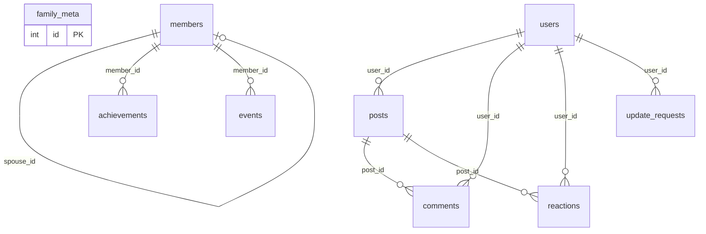

# 🗄️ Database Schema — VuFamily

> Supabase PostgreSQL  
> Project: `xalfitllpnjuzgmsreqw`  
> Chạy schema: `supabase-schema.sql` trong SQL Editor

---

## 📋 Danh Sách Bảng

| # | Bảng | Mô tả | RLS |
|---|------|--------|-----|
| 1 | `family_meta` | Thông tin dòng họ (tên, mô tả, quê quán) | ✅ |
| 2 | `members` | Thành viên gia phả | ✅ |
| 3 | `achievements` | Thành tựu / bằng cấp / công việc | ✅ |
| 4 | `events` | Sự kiện gia đình | ✅ |
| 5 | `users` | Tài khoản đăng nhập | ✅ |
| 6 | `update_requests` | Yêu cầu chỉnh sửa (viewer → admin) | ✅ |
| 7 | `posts` | Bảng tin dòng họ | ✅ |
| 8 | `comments` | Bình luận bài đăng | ✅ |
| 9 | `reactions` | Cảm xúc (emoji) bài đăng | ✅ |

---

## 📐 Chi Tiết Bảng

### 1. `family_meta` — Thông tin dòng họ

| Column | Type | Default | Mô tả |
|--------|------|---------|--------|
| `id` | `SERIAL` PK | auto | |
| `family_name` | `TEXT` | `'Vũ'` | Tên dòng họ |
| `description` | `TEXT` | `''` | Mô tả |
| `origin_place` | `TEXT` | `''` | Quê quán gốc |
| `created_at` | `TIMESTAMPTZ` | `NOW()` | |

---

### 2. `members` — Thành viên gia phả

| Column | Type | Constraints | Mô tả |
|--------|------|-------------|--------|
| `id` | `SERIAL` PK | | |
| `name` | `TEXT` | `NOT NULL` | Họ tên |
| `gender` | `INTEGER` | `CHECK(0,1)` | 0=Nữ, 1=Nam |
| `birth_date` | `TEXT` | | Ngày sinh (ISO) |
| `birth_time` | `TEXT` | | Giờ sinh |
| `death_date` | `TEXT` | | Ngày mất |
| `birth_place` | `TEXT` | | Nơi sinh |
| `death_place` | `TEXT` | | Nơi mất |
| `occupation` | `TEXT` | | Nghề nghiệp |
| `phone` | `TEXT` | | SĐT |
| `email` | `TEXT` | | Email |
| `address` | `TEXT` | | Địa chỉ |
| `note` | `TEXT` | | Ghi chú |
| `photo` | `TEXT` | | Ảnh (base64 hoặc URL) |
| `birth_order` | `INTEGER` | | Thứ tự con |
| `child_type` | `TEXT` | `CHECK('biological','adopted')` | Loại con |
| `parent_id` | `INTEGER` FK | → `members(id)` ON DELETE SET NULL | Cha/mẹ |
| `spouse_id` | `INTEGER` FK | → `members(id)` ON DELETE SET NULL | Vợ/chồng |
| `generation` | `INTEGER` | Default `1` | Đời thứ mấy |
| `created_at` | `TIMESTAMPTZ` | `NOW()` | |
| `updated_at` | `TIMESTAMPTZ` | `NOW()` | |

**Indexes:** `parent_id`, `spouse_id`, `name`, `generation`

**Quan hệ:**
```
members.parent_id → members.id   (self-referencing, cây gia phả)
members.spouse_id → members.id   (self-referencing, vợ/chồng)
```

---

### 3. `achievements` — Thành tựu

| Column | Type | Constraints | Mô tả |
|--------|------|-------------|--------|
| `id` | `SERIAL` PK | | |
| `member_id` | `INTEGER` FK | → `members(id)` CASCADE | |
| `category` | `TEXT` | `CHECK('education','work','social','award','other')` | Loại |
| `title` | `TEXT` | `NOT NULL` | Tiêu đề |
| `organization` | `TEXT` | | Tổ chức |
| `start_year` | `INTEGER` | | Năm bắt đầu |
| `end_year` | `INTEGER` | | Năm kết thúc |
| `description` | `TEXT` | | Mô tả |
| `created_at` | `TIMESTAMPTZ` | `NOW()` | |

---

### 4. `events` — Sự kiện

| Column | Type | Constraints | Mô tả |
|--------|------|-------------|--------|
| `id` | `SERIAL` PK | | |
| `member_id` | `INTEGER` FK | → `members(id)` SET NULL | |
| `event_type` | `TEXT` | Default `'other'` | Loại sự kiện |
| `event_date` | `TEXT` | | Ngày sự kiện |
| `title` | `TEXT` | `NOT NULL` | Tiêu đề |
| `description` | `TEXT` | | Mô tả |
| `created_at` | `TIMESTAMPTZ` | `NOW()` | |

---

### 5. `users` — Tài khoản

| Column | Type | Constraints | Mô tả |
|--------|------|-------------|--------|
| `id` | `SERIAL` PK | | |
| `username` | `TEXT` | `UNIQUE NOT NULL` | Tên đăng nhập |
| `password` | `TEXT` | `NOT NULL` | Hash bcrypt |
| `display_name` | `TEXT` | | Tên hiển thị |
| `role` | `TEXT` | `CHECK('admin','viewer')` | Quyền |
| `token` | `TEXT` | | Session token |
| `created_at` | `TIMESTAMPTZ` | `NOW()` | |
| `updated_at` | `TIMESTAMPTZ` | `NOW()` | |

**Default accounts:**
| Username | Role | Mặc định |
|----------|------|----------|
| `dangvq` | admin | Quản trị chính |
| `admin` | admin | Quản trị phụ |
| `viewer` | viewer | Tài khoản xem |

---

### 6. `update_requests` — Yêu cầu chỉnh sửa

| Column | Type | Constraints | Mô tả |
|--------|------|-------------|--------|
| `id` | `SERIAL` PK | | |
| `user_id` | `INTEGER` FK | → `users(id)` CASCADE | Người gửi |
| `member_id` | `INTEGER` | `NOT NULL` | Member cần sửa |
| `changes` | `TEXT` | `NOT NULL` | JSON thay đổi |
| `note` | `TEXT` | | Ghi chú |
| `status` | `TEXT` | `CHECK('pending','approved','rejected')` | Trạng thái |
| `reviewed_by` | `INTEGER` FK | → `users(id)` SET NULL | Admin duyệt |
| `reviewed_at` | `TIMESTAMPTZ` | | Thời điểm duyệt |
| `reject_reason` | `TEXT` | | Lý do từ chối |
| `created_at` | `TIMESTAMPTZ` | `NOW()` | |

---

### 7. `posts` — Bảng tin

| Column | Type | Constraints | Mô tả |
|--------|------|-------------|--------|
| `id` | `SERIAL` PK | | |
| `content` | `TEXT` | `NOT NULL` | Nội dung bài |
| `author` | `TEXT` | `NOT NULL` | Tên tác giả |
| `author_role` | `TEXT` | Default `'viewer'` | Quyền tác giả |
| `user_id` | `INTEGER` FK | → `users(id)` SET NULL | |
| `created_at` | `TIMESTAMPTZ` | `NOW()` | |

---

### 8. `comments` — Bình luận

| Column | Type | Constraints | Mô tả |
|--------|------|-------------|--------|
| `id` | `SERIAL` PK | | |
| `post_id` | `INTEGER` FK | → `posts(id)` CASCADE | Bài đăng |
| `content` | `TEXT` | `NOT NULL` | Nội dung |
| `author` | `TEXT` | `NOT NULL` | Tên |
| `author_role` | `TEXT` | Default `'viewer'` | Quyền |
| `user_id` | `INTEGER` FK | → `users(id)` SET NULL | |
| `created_at` | `TIMESTAMPTZ` | `NOW()` | |

---

### 9. `reactions` — Cảm xúc

| Column | Type | Constraints | Mô tả |
|--------|------|-------------|--------|
| `id` | `SERIAL` PK | | |
| `post_id` | `INTEGER` FK | → `posts(id)` CASCADE | Bài đăng |
| `user_id` | `INTEGER` FK | → `users(id)` CASCADE | Người react |
| `emoji` | `TEXT` | `NOT NULL` | Emoji (❤️👍😂😮😢) |
| `created_at` | `TIMESTAMPTZ` | `NOW()` | |

**Constraint:** `UNIQUE(post_id, user_id, emoji)` — mỗi user chỉ react 1 lần/emoji/bài

---

## 🔗 Sơ Đồ Quan Hệ



---

## 🔒 Row Level Security

Tất cả bảng đều bật RLS với policy:
```sql
CREATE POLICY "Service role full access" ON <table>
    FOR ALL USING (true) WITH CHECK (true);
```
> **Lưu ý:** Supabase service key tự động bypass RLS. 
> Policy này cho phép truy cập đầy đủ qua service role.
> Sử dụng `anon` key thì cần thêm policy phù hợp.
