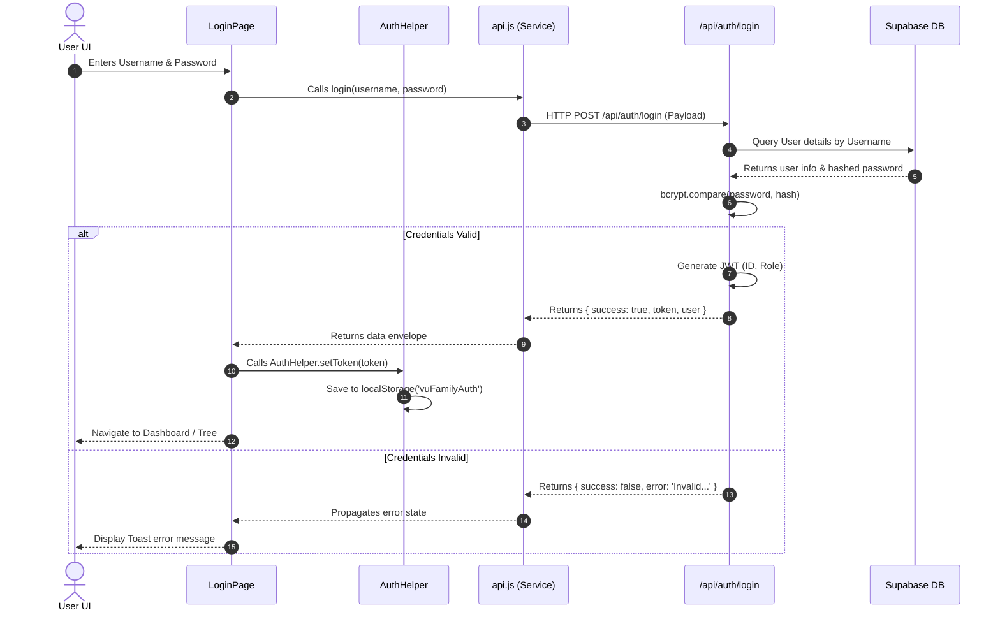
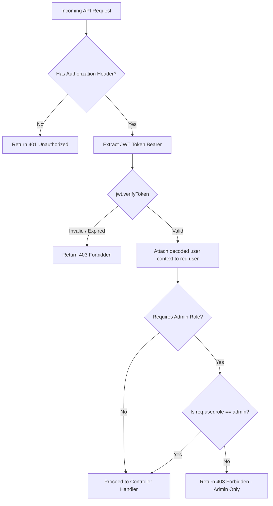

# Feature: Authentication (Auth)

## 1. Overview
The Authentication module handles login, registration, password policies, user roles (Viewer, Editor, Admin), and session management. It secures server-side serverless endpoints and client-side page transitions.

---

## 2. Directory Structure
- **Client Components**: `client/src/features/auth/`
    - `LoginPage.jsx` (Login & registration layouts)
    - `ProfileModal.jsx` (User settings and password update popup)
- **Shared Helpers**:
    - `client/src/shared/services/AuthHelper.js` (Session management and token getters/setters)
- **Server Endpoints**: `/api/auth/*` (e.g. `api/auth/login.js`, `api/auth/me.js`)
- **Server Security Middleware**: `server/middleware/`

---

## 3. Core Features
1. **User Login (`/api/auth/login`)**:
   - Compares credentials, validates against hashed passwords in Supabase using `bcryptjs`.
   - Generates and returns a JSON Web Token (JWT) containing user identity and role.
2. **Session Persistence (`/api/auth/me`)**:
   - Auto-checks token stored in client's `localStorage` on application startup to verify if session remains valid.
3. **Password Security Policy**:
   - Password changes must satisfy Regex: `^(?=.*[a-z])(?=.*[A-Z])(?=.*[0-9])(?=.*[!@#$%^&*])(?=.{8,})` (Min 8 chars, 1 uppercase, 1 lowercase, 1 number, 1 special character).

---

## 4. Sequence & Control Flow Diagrams

### 4.1. Login Sequence Flow
The diagram below represents how client credentials flow through the system and how token sessions are generated.

### 4.2. API Middleware Authentication Flow
This flowchart describes how the server validates JWT tokens on protected REST endpoints.

