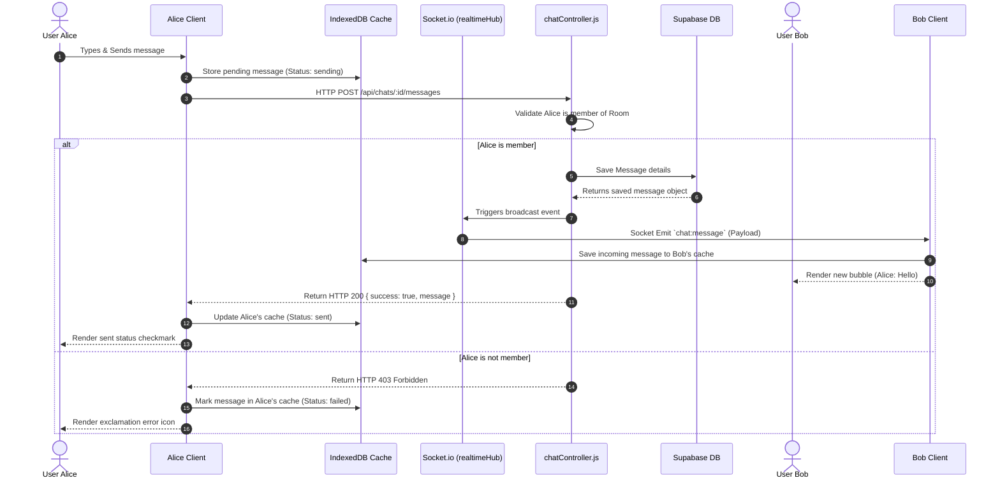
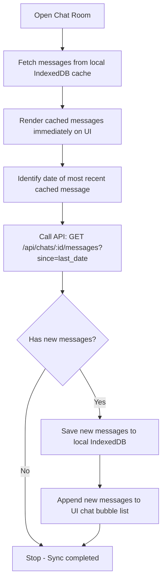

# Feature: Real-time Chat & Calling

## 1. Overview
The Real-time Chat module handles direct and group messaging, offline message caching using IndexedDB, and WebRTC voice/video signaling. It functions entirely in-house without relying on third-party messaging services.

---

## 2. Directory Structure
- **Frontend Components**: `client/src/features/chat/`
    - `ChatPage.jsx` (Chat room layouts and message bubbles)
    - `VoiceCall.jsx` (Voice & video call overlay component using WebRTC signaling)
- **Shared Helpers**:
    - `client/src/shared/services/chatCache.js` (IndexedDB schema & message cache operations)
- **Server Logic**:
    - `server/controllers/chatController.js` (Business rules and membership validation)
    - `server/utils/realtimeHub.js` (Socket.io event broadcaster)
- **API Routes**: `/api/chats/*`

---

## 3. Core Features
1. **Incremental Fetching**:
   - UI instantly renders old messages from IndexedDB cache (`chatCache.js`) for instant loading.
   - Client sends background query `GET /api/chats/:id/messages?since=[last_cached_date]` to fetch only incremental updates and updates local cache.
2. **Real-time Broadcaster**:
   - Server-side Socket.io hub broadcasts incoming messages immediately to online room members.

---

## 4. Flow & Architecture Diagrams

### 4.1. Real-time Message Lifecycle
The diagram below describes the sequence of sending a message, broadcasting it over WebSockets, and updating local browser caches.

### 4.2. Chat Synchronization Protocol
Flowchart representing how the client updates messages efficiently on startup.

