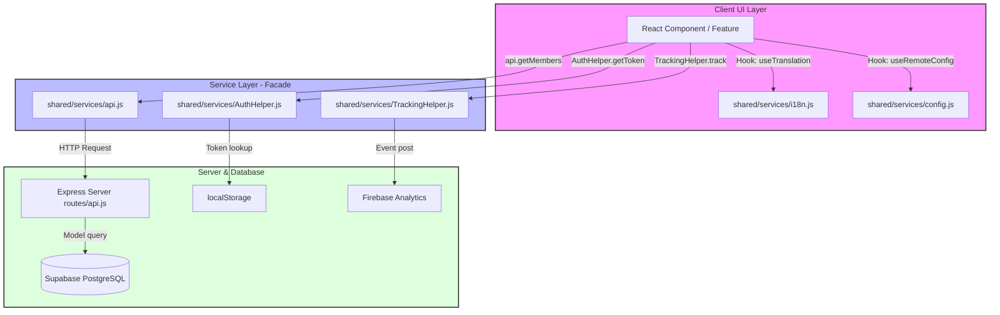

# VuFamily — Project Overview

## 1. Executive Summary
VuFamily is a collaborative, real-time web application dedicated to managing the lineage of the **Vu Family (Gia phả Dòng họ Vũ)**. The system enables family members to view and explore the family tree, manage member achievements, post family news, schedule events/anniversaries, and communicate via real-time chat and video calling. 

It implements a strict role-based access control (RBAC) to ensure changes to the lineage are verified before publishing.

---

## 2. Core Tech Stack
- **Frontend**: React + Vite (Vanilla CSS for custom layout styling)
- **Backend**: Node.js + Express (Local server) & Vercel Serverless Functions (`api/` endpoint gateway)
- **Real-Time signaling**: Socket.io (for messaging and calling)
- **Storage/Databases**: Supabase (PostgreSQL client) & local cache (IndexedDB)
- **Configuration & Analytics**: Firebase (Remote Config & Analytics)

---

## 3. High-Level System Architecture
VuFamily follows a decoupled architecture, isolating the UI layers from the networking logic through a strict **Facade & Service Layer Pattern**.

---

## 4. Codebase Directory Map
- `client/src/features/`: Contains modular React folders, each housing components and local styles for a specific feature.
- `client/src/shared/`: Centralized utilities, hooks, components (Header, Sidebar), and services (api, helpers) used throughout the UI.
- `client/src/styles/`: Central design tokens and global styles (light/dark themes).
- `server/`: Express backend containing routes, controllers, and models.
- `api/`: Vercel Serverless Function entry routes mimicking the local server routes.
- `database/`: Database schema files and Supabase client definitions.
- `docs/`: All specification, architecture, database schema, and feature documentation files.

---

## 5. Core Module Registry (Feature Map)
Refer to these specification documents before modifying or implementing code for any specific feature:

| Feature / Module Name | Code Directory | Specification Link | Status |
|-----------------------|----------------|--------------------|--------|
| **Authentication (Auth)** | `client/src/features/auth/` | [AUTH.md](file:///e:/_Web/VuFamily/docs/features/AUTH.md) | [Production] |
| **Family Tree (Tree)** | `client/src/features/tree/` | [TREE.md](file:///e:/_Web/VuFamily/docs/features/TREE.md) | [Production] |
| **Newsfeed** | `client/src/features/newsfeed/` | [NEWSFEED.md](file:///e:/_Web/VuFamily/docs/features/NEWSFEED.md) | [Production] |
| **Calendar** | `client/src/features/calendar/` | [CALENDAR.md](file:///e:/_Web/VuFamily/docs/features/CALENDAR.md) | [Production] |
| **Chat & Calling (Chat)**| `client/src/features/chat/` | [CHAT.md](file:///e:/_Web/VuFamily/docs/features/CHAT.md) | [Production] |
| **Edit History** | `client/src/features/history/` | [HISTORY_REQUESTS.md](file:///e:/_Web/VuFamily/docs/features/HISTORY_REQUESTS.md) | [Production] |
| **Request Approvals** | `client/src/features/requests/` | [HISTORY_REQUESTS.md](file:///e:/_Web/VuFamily/docs/features/HISTORY_REQUESTS.md) | [Production] |
| **System Admin** | `client/src/features/system/` | [SYSTEM_ADMIN.md](file:///e:/_Web/VuFamily/docs/features/SYSTEM_ADMIN.md) | [Production] |
| **Dashboard** | `client/src/features/dashboard/` | [DASHBOARD.md](file:///e:/_Web/VuFamily/docs/features/DASHBOARD.md) | [Production] |
| **Finance Management** | `client/src/features/finance/` | [FINANCE.md](file:///e:/_Web/VuFamily/docs/features/FINANCE.md) | [Production] |
| **Cross Platform Deploy**| `docs/features/CROSS_PLATFORM.md`| [CROSS_PLATFORM.md](file:///e:/_Web/VuFamily/docs/features/CROSS_PLATFORM.md) | [Production] |

---

## 6. Project Reference Links
- [Tài liệu Kiến trúc & Quy tắc Tổng hợp](file:///e:/_Web/VuFamily/docs/STRUCTURE_AND_RULES.md) - Architecture design overview.
- [Enterprise Coding Rules](file:///e:/_Web/VuFamily/docs/RULES.md) - Deep dive coding standards and steel rules.
- [Service Layer API Reference](file:///e:/_Web/VuFamily/docs/SERVICE_LAYER_API.md) - Gateway API method mapping.
- [REST API Specifications](file:///e:/_Web/VuFamily/docs/API.md) - Server route endpoints mapping.
- [Database Schema Specifications](file:///e:/_Web/VuFamily/docs/DATABASE.md) - PostgreSQL tables, schemas, and indices.
- [Firebase Remote Config Standards](file:///e:/_Web/VuFamily/docs/REMOTE_CONFIG_STANDARD.md) - Feature Flags configuration values.
