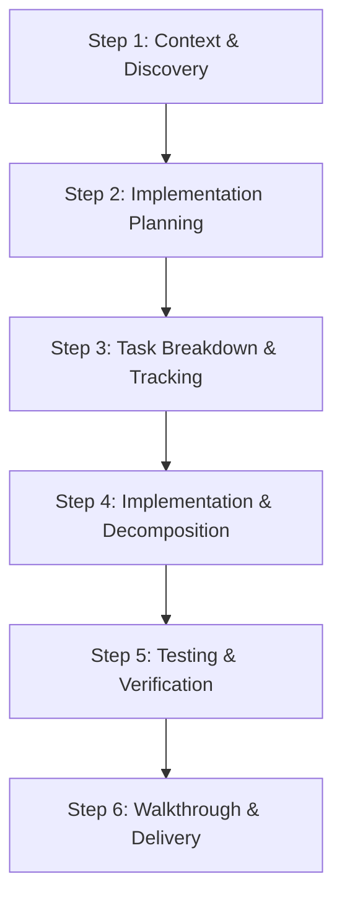

# VuFamily — Project Workflow & AI Guidelines

This document details the development lifecycle, feature integration protocols, and coding constraints required to maintain code quality and maximize AI developer speed on the VuFamily project.

---

## 1. Universal Development Workflow
Every feature implementation, bug fix, or refactoring task **MUST** run through this sequence:

### Phase 1: Context & Discovery (Feature Discovery Protocol)
*   **Locate Overview**: Read [overview.md](file:///e:/_Web/VuFamily/docs/overview.md) at the beginning of the session.
*   **Registry Lookup**: Find the target module in the **Core Module Registry** table inside `overview.md`.
*   **Open Specifications**: Follow the specification link (e.g., `docs/features/AUTH.md`) to read business rules, edge cases, and analyze the Mermaid flowcharts.
*   **Locate Code Entry**: Only inspect code folders registered in the registry. **Do not browse folders blindly.**

### Phase 2: Implementation Planning
*   **Create/Update Plan**: Write a detailed draft in `implementation_plan.md`.
*   **Decomposition Mapping**: Ensure that all newly proposed files or modified files are planned to remain **under 300 lines of code**. If a file exceeds this budget, design how to split it into hooks (`client/src/shared/hooks/`), utility helpers (`client/src/shared/utils/`), or atomic subcomponents.
*   **Approval**: Stop and seek developer approval before writing source code.

### Phase 3: Tasking & Tracking (`task.md`)
*   **Checklist Creation**: Create a `task.md` detailing the checklist of tasks.
*   **Real-Time State Tracking**: Update task states using:
    *   `[ ]` Uncompleted.
    *   `[/]` In-progress.
    *   `[x]` Completed.

### Phase 4: Implementation & Architecture Constraints
Write code complying strictly with the **VuFamily Architecture Rules**:
- **Facade Enforcements**:
    - **API Requests**: All network calls MUST go through `shared/services/api.js`. Never write raw `fetch()` or `axios` inside components.
    - **Tokens**: Read and write auth sessions only through `AuthHelper.getToken()`. Never access `localStorage` directly in UI code.
    - **Analytics**: Push events only using `TrackingHelper.TrackingEvent()`. Never call Firebase SDK directly.
    - **i18n**: Wrap all text elements in `t('key')` from `useTranslation()`. Never hardcode raw strings in JSX.
    - **Logging**: Use `myLog()`, `myError()`, `myWarning()` from `shared/utils/logger.js`. Never write `console.log`.
- **Typing &Contracts**: Add detailed JSDoc type parameters to any helper or service function.

### Phase 5: Testing & Verification
*   Execute build scripts (`npm run build` or local developer tests) to verify compilation.
*   Log edge case test results in `task.md`.

### Phase 6: Walkthrough & Delivery
*   Create a `walkthrough.md` mapping:
    - Code changes (with markdown links).
    - Verification outcomes.
    - Updated Mermaid diagrams if flows were modified.

---

## 2. 7-Step Rule for Adding New Features
When adding any new feature, follow this exact sequence:

1.  **Create Folder**: Create a subfolder inside `client/src/features/[feature_name]/` containing components and feature-specific styles.
2.  **Add Endpoints**: Append necessary network call methods to `client/src/shared/services/api.js`.
3.  **Define Keys**: Add localization key-values to `client/src/shared/services/i18n.js` (supporting both `vi` and `en`).
4.  **Register Tracking**: Define analytics events inside `client/src/shared/services/TrackingHelper.js`.
5.  **Configure Feature Flag**: Register a toggle variable in `client/src/config.js` (e.g., `feature_[name]_enabled: true`).
6.  **Setup Routing**: Register the route in `client/src/App.jsx` and the sidebar link in `client/src/components/Sidebar.jsx` wrapped reactive-ly with Remote Config toggles.
7.  **Create Specs**: Create a new file `docs/features/[FEATURE_NAME].md` containing functional specifications and Mermaid flows, and register it in `docs/overview.md`.
